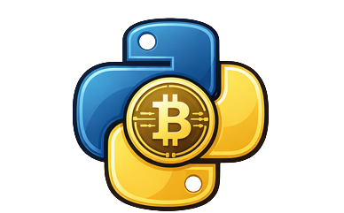

# 🪙 WobblyToken

<p align="center">
  
</p>

<p align="center">
  A lightweight blockchain simulation with Proof-of-Work, multi-node communication and transaction system.
</p>

<p align="center">
  
  
  
</p>

<p align="center">
  
  
  
  
</p>


## État actuel

Mini-blockchain avec 2 nœuds qui communiquent, minent et mettent à jour une blockchain.

## Fonctionnalités

- `/mine` : crée un nouveau bloc
- `/receive_block` : reçoit un bloc depuis l’autre nœud
- `/chain` : affiche la blockchain
- `/sync` : synchronise la blockchain avec l’autre nœud
- `/transaction` : Affiche le mempool avec méthode GET et envoie des transactions avec POST 

## Urls

http://localhost:5001/....
http://localhost:5002/....

Remplace les .... avec une des routes si dessus

## Utilisation

```bash
git clone https://github.com/MeuxyVex/WobblyToken
cd WobblyToken/blockchain-simulation
docker compose up --build

```

## Transactions

```bash
curl -X POST http://localhost:5001/transaction \
-H "Content-Type: application/json" \
-d "{\"sender\":\"Alice\",\"receiver\":\"Bob\",\"amount\":10}"
```
